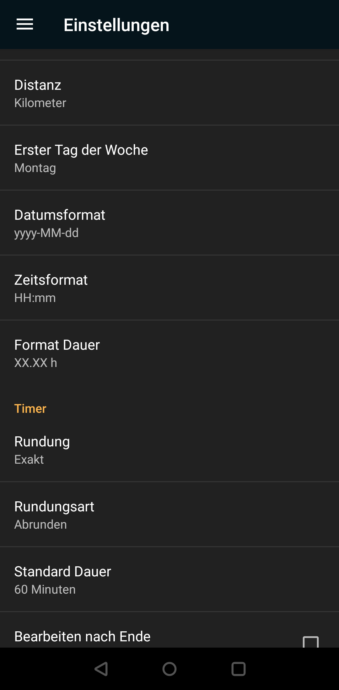
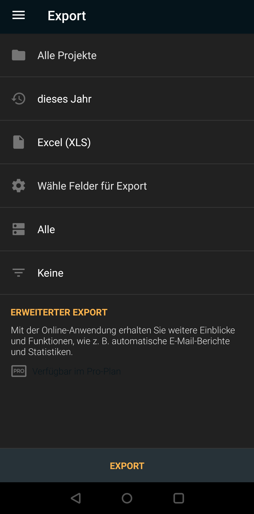
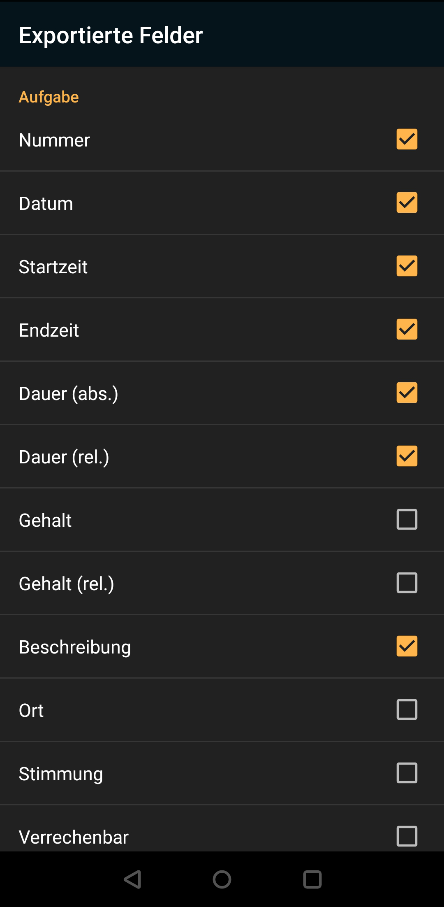
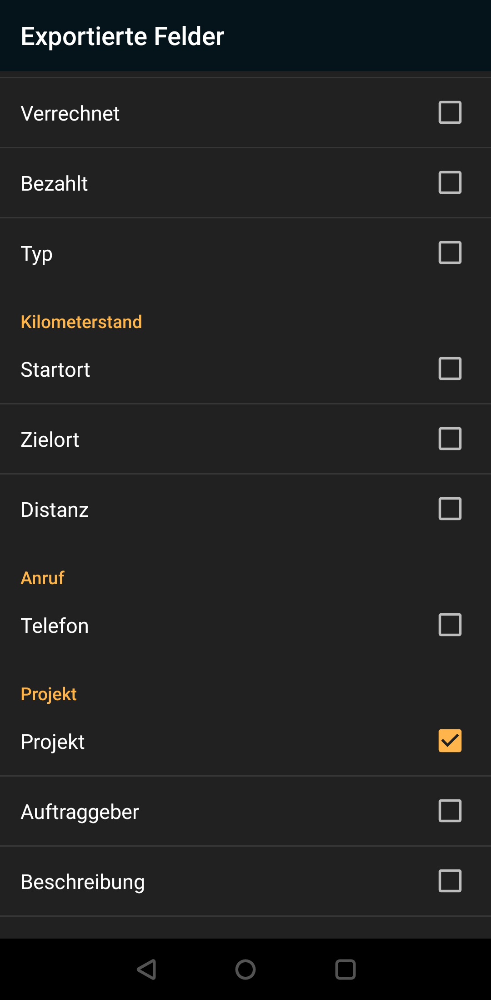

# timesheet_tool
groups timesheet.io app exports per day and project

Dieses Tool hilft dabei erfasste Arbeitszeit von der Timesheet-App leichter zu analysieren

# Anleitung

## App bekommen

[Android](https://play.google.com/store/apps/details?id=com.rauscha.apps.timesheet&referrer=utm_source%3Dlanding%26utm_medium%3Dbanner%26utm_campaign%3Ddownload)

[Apple](https://timesheet.io/img/webp/appstore.webp)

## Konfiguration der App
Die App kann man wie gewünscht einstellen, es gibt nur hier eine Einstellung die getroffen werden soll:



- Datumsformat yyyy-MM-dd
- Format Dauer XX.XX h

## Export aus der App
Die App kann dann die Daten exportieren:




Dabei sollte man den Zeitrahmen einstellen. Der Export erfolgt nach XLS.

Die Felder für den Export sind wie folgt zu treffen:





## Python Skript

### Abhängigkeiten installieren
Die Python abhängigkeiten müssen installiert werden. Dies kann man einfach machen mit dem Befehl

```
pip install -r requirements.txt
```
### Konfiguration von Farben
Danach sollte die config.yaml bereitgestellt werden, eine Vorlage ist unter config.example.yaml zu finden.
```
colors:
  - "Team 1": "00CCFF"
  - "Team 2": "f2b24b"
  - "Team 2 customer": "f2b24b"
  - "Division 1": "00CCFF"
  - "Intern": "f2594b"
```
Hier kann man in der Konfig die Farben für Projekte einstellen. Dies Hilft dabei schneller die Projekte in andere Systeme abzuschreiben.

### Skript ausführen

Die exportierten Daten kommen in den Ordner des Skriptes, die Berechnungen starten dann mit 

```
python generate.py
```

Auf der Konsole gibt es einige Ausgaben, dazu kommt eine excel Datei als Ausgabe, Calced_timesheet.xlsx.